

  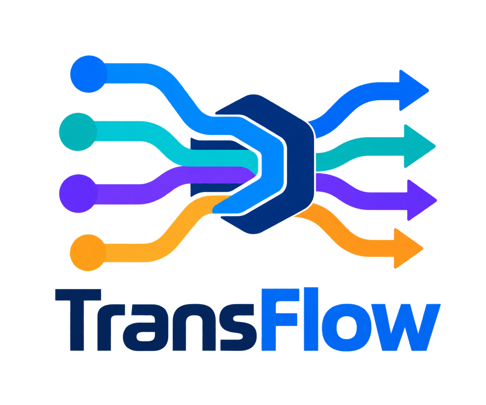

<h1 align="center">TransFlow — Real-Time Financial Transaction Data Platform</h1>

  Real-Time Payment Processing for a Payment Service Provider (PSP)

 

# 📌 Description

TransFlow is an end-to-end **real-time financial transaction data platform** designed for a **Payment Service Provider (PSP)** to ingest, process, store, analyze, monitor, and detect anomalies in financial transactions.

The platform combines **real-time data streaming**, **Azure Data Engineering**, distributed data processing, analytical querying, business intelligence, workflow orchestration, monitoring, and machine learning into a complete cloud-based data platform.

Transaction data is collected from **PostgreSQL** and **Stripe Sandbox**, streamed through **Apache Kafka**, and processed through an **Azure-centered Data Engineering architecture** built around **Azure Data Lake Storage Gen2, Azure Databricks, Azure Synapse Analytics, and Azure Functions**.

The platform delivers analytical insights through **Power BI**, while **Apache Airflow** orchestrates the workflows and **Grafana** provides end-to-end platform monitoring.

 

# 🔍 Project Overview

TransFlow implements a complete **Azure Data Engineering platform**, covering real-time ingestion, distributed processing, scalable cloud storage, SQL analytics, visualization, orchestration, monitoring, and machine learning-based anomaly detection.

The platform includes:

- Multi-source transaction ingestion from **PostgreSQL** and **Stripe Sandbox**
- Real-time event streaming using **Apache Kafka**
- Dedicated Kafka topics for PostgreSQL and Stripe transaction streams
- A **Medallion Architecture on Azure Data Lake Storage Gen2**
- Bronze, Silver, and Gold data layers
- **Delta Lake** tables in the Silver and Gold layers
- Distributed data processing using **Azure Databricks and PySpark**
- SQL analytics using **Azure Synapse Analytics Serverless SQL Pool**
- Interactive transaction analytics using **Power BI**
- End-to-end workflow orchestration using **Apache Airflow**
- End-to-end platform monitoring using **Grafana**
- Hourly batch anomaly detection using **Isolation Forest**
- ML batch execution and PDF report generation using **Azure Functions**
- Automated storage of generated reports in **Azure Data Lake Storage Gen2**

 

# 🎯 Objectives

- Build a complete **real-time financial transaction data platform**
- Design an **Azure-centered Data Engineering architecture**
- Ingest transactions from multiple heterogeneous sources
- Implement reliable **event streaming with Apache Kafka**
- Build a scalable **Medallion Data Lake on Azure Data Lake Storage Gen2**
- Process transaction data using **Azure Databricks and PySpark**
- Provide a SQL analytics layer through **Azure Synapse Serverless SQL Pool**
- Deliver interactive transaction analytics through **Power BI**
- Orchestrate the complete platform using **Apache Airflow**
- Monitor the technical platform using **Grafana**
- Detect anomalous financial transactions using **Isolation Forest**
- Generate automated hourly PDF anomaly reports using **Azure Functions**

 

# 🏗️ Architecture

TransFlow is built around an **Azure Data Engineering architecture** that connects real-time transaction ingestion with scalable cloud storage, distributed processing, SQL analytics, and business intelligence.

The main data flow is:

**Data Sources → Apache Kafka → Microsoft Azure → Azure Synapse Analytics → Power BI**

  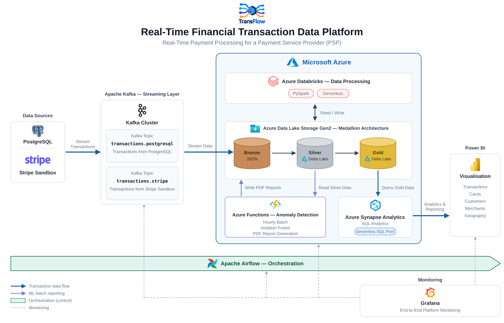

 

The architecture is organized around:

- **Data Sources** → PostgreSQL and Stripe Sandbox
- **Streaming Layer** → Apache Kafka
- **Azure Data Lake** → Azure Data Lake Storage Gen2
- **Data Processing** → Azure Databricks / PySpark
- **SQL Analytics** → Azure Synapse Analytics
- **Visualization** → Power BI
- **Orchestration** → Apache Airflow
- **Monitoring** → Grafana
- **Anomaly Detection** → Azure Functions / Isolation Forest

The core of the platform is the **Microsoft Azure Data Engineering layer**, where transaction data is stored, processed, transformed, and prepared for analytics.

 

# ⚙️ Tech Stack

### 💻 Programming & Data Processing

  
  
  

---

### 🔄 Streaming & Data Engineering

  
  
  

---

### ☁️ Azure Data Engineering

  
  
  
  
  
  

---

### 📊 Analytics & Visualization

  
  

---

### 🤖 Machine Learning

  
  

 

# 🚀 Features

- 🔄 **Multi-Source Transaction Ingestion**  
  Ingest transaction data from PostgreSQL and Stripe Sandbox.

- 📡 **Real-Time Transaction Streaming**  
  Stream transaction events through dedicated Apache Kafka topics.

- ☁️ **Azure Data Lake Medallion Architecture**  
  Organize transaction data into Bronze, Silver, and Gold layers using Azure Data Lake Storage Gen2.

- ⚡ **Distributed Data Processing**  
  Process and transform transaction data using Azure Databricks and PySpark.

- 🧱 **Delta Lake Storage**  
  Store structured Silver and Gold data using Delta Lake.

- 📊 **SQL Analytics on Azure**  
  Query Gold analytical data through Azure Synapse Serverless SQL Pool.

- 📈 **Transaction Analytics Dashboard**  
  Analyze transactions, payments, cards, customers, merchants, and geographic information using Power BI.

- 🔄 **End-to-End Orchestration**  
  Coordinate the data and ML workflows using Apache Airflow.

- 📡 **End-to-End Platform Monitoring**  
  Monitor the technical platform using Grafana.

- 🤖 **Transaction Anomaly Detection**  
  Detect anomalous financial transactions using an Isolation Forest model.

- 📄 **Automated ML Reporting**  
  Generate hourly PDF reports containing anomaly detection results through Azure Functions.

 

# 📡 Kafka Streaming Architecture

Apache Kafka provides the streaming layer of the TransFlow platform.

The architecture uses two dedicated topics:

- `transactions.postgresql`
- `transactions.stripe`

Each topic receives transaction events from its corresponding source.

  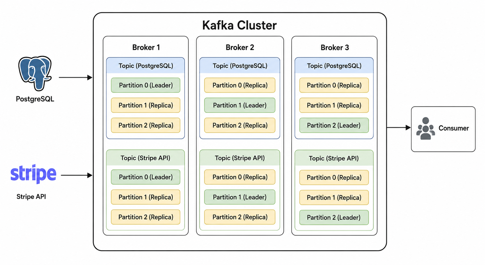

 

Kafka producers publish transaction events while consumers retrieve the events and forward them into the **Azure Data Engineering platform**.

 

# ⚡ Data Processing — Azure Databricks

**Azure Databricks** is responsible for distributed transaction data processing using **PySpark**.

The processing pipeline implements the Medallion Architecture:

**Bronze → Silver → Gold**

The Bronze layer receives the ingested transaction data, while the Silver and Gold layers provide progressively structured data for analytics.

  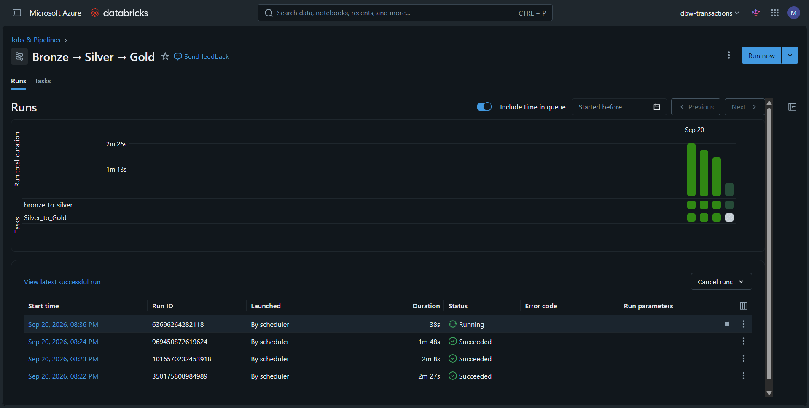

The screenshot above shows successful Databricks job executions for the Azure data processing pipeline.

 

# 🔄 Workflow Orchestration — Apache Airflow

Apache Airflow is used as the central orchestration layer of the platform.

It coordinates the execution of the streaming, Azure data processing, and machine learning workflows.

  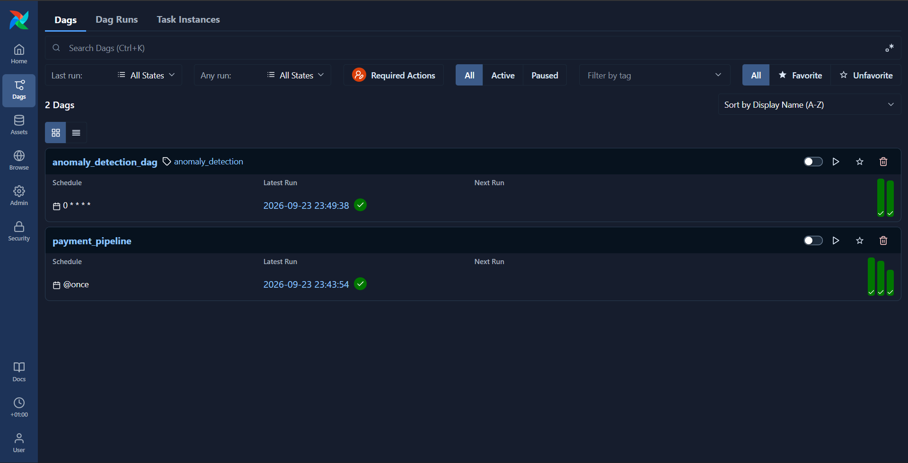

The Airflow environment contains the two main DAGs used to orchestrate the TransFlow platform.

 

# 📊 Platform Monitoring — Grafana

Grafana provides **End-to-End Platform Monitoring** for the TransFlow platform.

Monitoring covers the technical components involved in the data platform, including streaming, Azure data processing, orchestration, and infrastructure.

  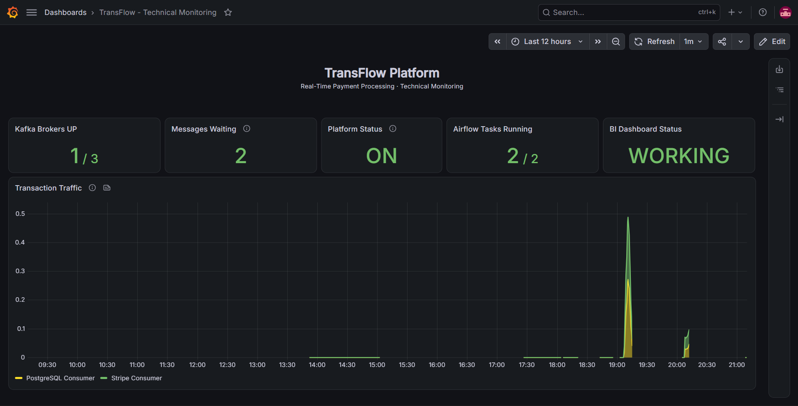

 

# 🤖 Anomaly Detection & ML Reporting

TransFlow integrates a machine learning component dedicated to transaction anomaly detection.

The model uses **Isolation Forest** to identify potentially anomalous transactions.

The ML pipeline is executed as an **hourly batch process** through Azure Functions.

The Azure Function:

1. Reads new transactions from the Silver layer
2. Loads the trained Isolation Forest model
3. Performs anomaly detection
4. Computes anomaly scores
5. Identifies anomalous transactions
6. Generates a PDF report
7. Stores the generated report in Azure Data Lake Storage

The generated reports contain information such as:

- Transaction ID
- Anomaly score
- Anomaly status
- Detection timestamp

Example of a generated anomaly detection report:

  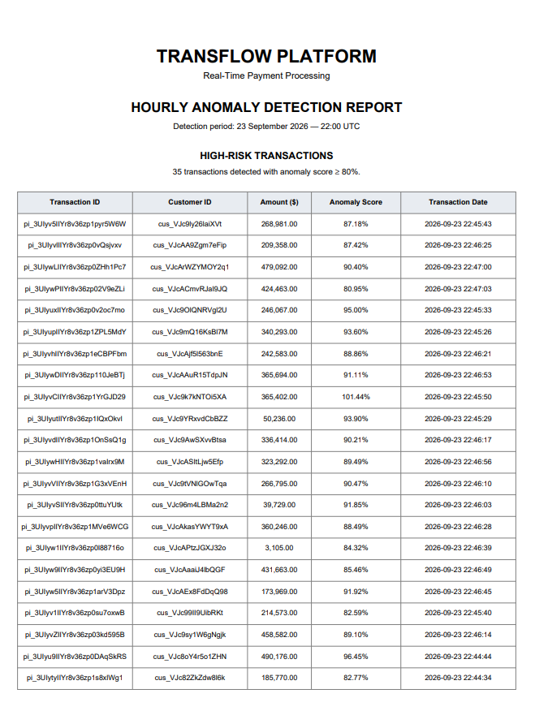

 

# 📊 Power BI Dashboard

Power BI provides the business analytics and visualization layer of TransFlow.

The dashboard enables analysis of:

- Transactions
- Payments
- Cards
- Customers
- Merchants
- Geography

### 🏠 Home

  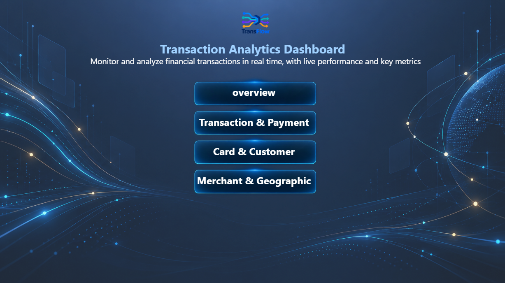

The home page provides the main entry point to the transaction analytics dashboard.

---

### 📈 Overview

  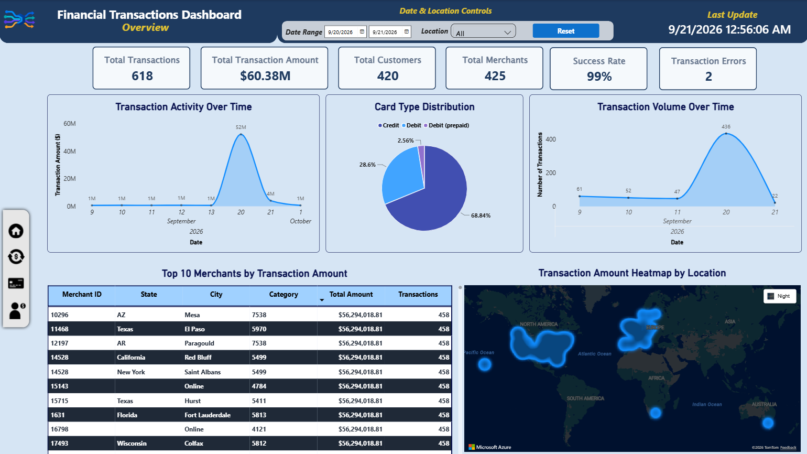

The Overview page presents the main transaction KPIs and high-level analytics.

---

### 💳 Transaction & Payment Analysis

  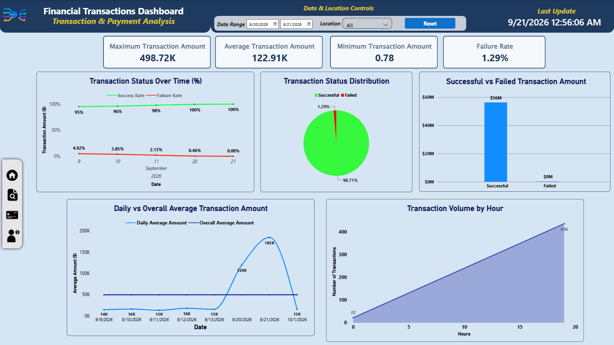

This page focuses on transaction and payment behavior and provides detailed analytical views.

---

### 👤 Card & Customer Analysis

  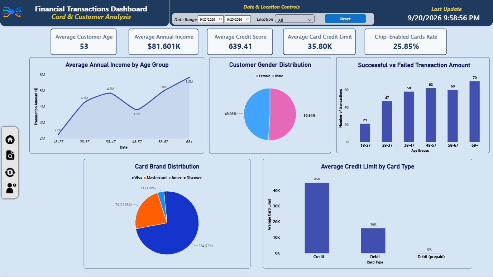

This page provides analytical insights related to cards and customers.

---

### 🌍 Merchant & Geographic Analysis

  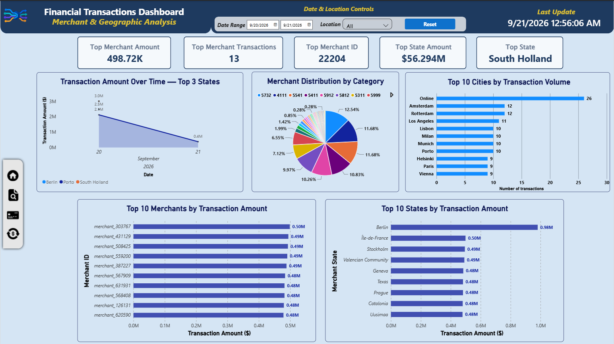

This page provides merchant and geographic analysis of the transaction data.

 

# 🔄 End-to-End Workflow

The complete TransFlow workflow can be summarized as:

<pre><code>PostgreSQL ────────┐
                   ├──→ Apache Kafka
Stripe Sandbox ────┘
                         │
                         ↓
                Azure Data Lake Gen2
                         │
                 Bronze → Silver → Gold
                         │
                    Databricks
                         │
                         ↓
                  Azure Synapse
                         │
                         ↓
                     Power BI</code></pre>

The machine learning branch operates independently from the main BI flow:

<pre><code>ADLS Silver
     │
     ↓
Azure Functions
     │
Isolation Forest
     │
     ↓
PDF Reports</code></pre>

Apache Airflow orchestrates the platform, while Grafana provides end-to-end monitoring.

 

# 🖥️ Installation

Clone the repository:

<pre><code>git clone &lt;REPOSITORY_URL&gt;
cd &lt;PROJECT_DIRECTORY&gt;</code></pre>

Install the required Python dependencies:

<pre><code>pip install -r requirements.txt</code></pre>

Additional service-specific configuration is required for:

- PostgreSQL
- Apache Kafka
- Microsoft Azure
- Azure Databricks
- Azure Synapse
- Apache Airflow
- Grafana

Configuration values and credentials should be provided through environment variables and local configuration files.

 

# 🚀 Usage

The TransFlow platform is composed of several coordinated services:

- Start the PostgreSQL data source.
- Start the Kafka cluster.
- Run the Kafka producers.
- Run the Kafka consumers.
- Execute the Azure Databricks data processing pipeline.
- Query Gold data through Azure Synapse.
- Refresh and analyze the Power BI dashboard.
- Run Airflow to orchestrate the platform workflows.
- Use Grafana to monitor the platform.
- Allow the hourly Azure Function to execute the anomaly detection and generate the PDF report.

 

# 📌 Project Architecture Summary

| Layer | Technology | Role |
|---|---|---|
| Data Sources | PostgreSQL | Transaction data |
| Data Sources | Stripe Sandbox | Payment transaction data |
| Streaming | Apache Kafka | Real-time event streaming |
| Cloud Data Lake | Azure Data Lake Storage Gen2 | Medallion Data Lake |
| Data Processing | Azure Databricks | PySpark data processing |
| Storage Format | Delta Lake | Silver & Gold tables |
| SQL Analytics | Azure Synapse Analytics | SQL analytics |
| Visualization | Power BI | Transaction analytics |
| Orchestration | Apache Airflow | Workflow orchestration |
| Monitoring | Grafana | End-to-end monitoring |
| Machine Learning | Isolation Forest | Transaction anomaly detection |
| ML Execution | Azure Functions | Hourly batch reporting |

 

# ⭐ Conclusion

TransFlow is a complete **Azure-centered Real-Time Financial Transaction Data Platform** combining real-time streaming, cloud Data Engineering, scalable storage, distributed processing, SQL analytics, business intelligence, orchestration, monitoring, and machine learning.

The platform uses **Microsoft Azure as its core Data Engineering environment**, with **Azure Data Lake Storage Gen2**, **Azure Databricks**, **Azure Synapse Analytics**, and **Azure Functions** forming the main cloud architecture.

From transaction ingestion through **Apache Kafka**, data is processed through the Azure Medallion Architecture and made available for analytical consumption through **Azure Synapse and Power BI**.

The integration of **Apache Airflow** and **Grafana** provides centralized orchestration and end-to-end monitoring, while **Isolation Forest and Azure Functions** enable automated transaction anomaly reporting.

 

---

  <strong>MOUAAD BOUISHAK</strong>

